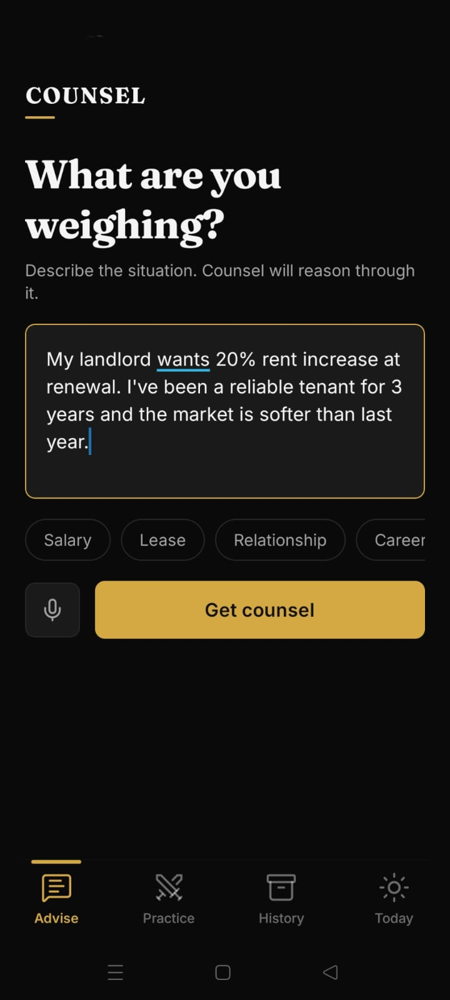
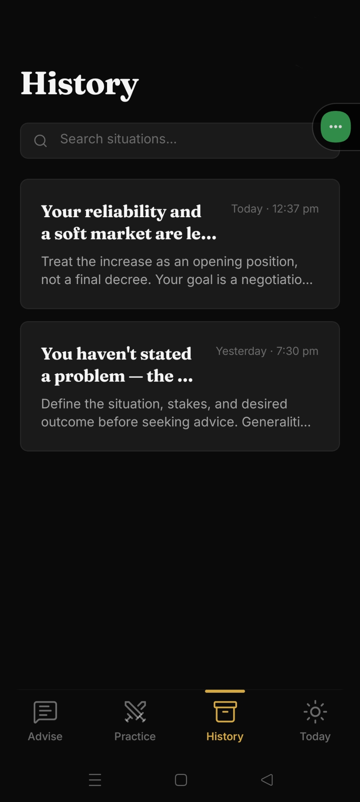

# Counsel
### Before you decide.

Counsel is a mobile-first AI strategic advisor for high-stakes decisions — salary negotiations, lease renewals, difficult conversations, career moves. Unlike chat-based AI tools, Counsel returns structured advice (strategy, talking points, likely outcomes, next steps, risk flags) and lets you practice the conversation against a role-played AI counterparty before the real thing.

---

## Screenshots

<table>
  <tr>
    <td></td>
    <td></td>
    <td></td>
  </tr>
  <tr>
    <td></td>
    <td></td>
    <td></td>
  </tr>
  <tr>
    <td></td>
    <td></td>
    <td></td>
  </tr>
  <tr>
    <td></td>
    <td></td>
    <td></td>
  </tr>
  <tr>
    <td></td>
    <td></td>
    <td></td>
  </tr>
</table>

---

## Why Counsel

Most AI advice apps are chat windows. They're great for brainstorming but terrible for decisions you actually need to make this week. Counsel ships structured output you can act on, a simulator that pressure-tests your plan, and a daily challenge that builds judgment over time. The goal isn't to replace your thinking — it's to sharpen it before the moment counts.

---

## Features

- **Advise** — Describe the situation, get structured strategic counsel: a headline read, recommended strategy, numbered talking points, best/likely/worst outcome chips, next steps, and risk flags. Counsel reasons through it, not just around it.
- **Practice** — Role-play the conversation against an AI counterparty at three difficulty levels (Cautious / Assertive / Aggressive). Scored on anchoring, framing, and concession discipline when you end the session.
- **Today** — A new strategic challenge every day drawn from a rotating set of real-world situations. Tap through to Counsel for instant advice, or use it as a thinking prompt. Build the muscle before you need it.
- **History** — Every saved situation, searchable, with its full advice card intact so you can revisit your reasoning before a follow-up conversation.

---

## Architecture

- **Expo SDK 55 + Expo Router** — file-based tab routing, `app/(tabs)/` structure
- **NativeWind v4 + Tailwind** — utility styling; **Reanimated 4** — enter/exit animations
- **Zustand + AsyncStorage** — in-memory state with persisted situation history
- **AI provider abstraction** — primary: OpenRouter → `deepseek/deepseek-chat-v3-1`; fallback: `google/gemini-2.5-flash-lite`. (Initially attempted NVIDIA NIM but free-tier request queueing made it unusable for live demos — switched mid-build.)
- **Local Node proxy** (`scripts/dev-proxy.js`, zero dependencies) — injects the OpenRouter API key server-side and resolves CORS for Expo Go on device. The same ~50-LOC handler deploys as a Cloudflare Worker for production with minimal changes.

---

## Tech Stack

- [Expo](https://expo.dev) / React Native
- TypeScript
- NativeWind v4 + Tailwind CSS
- Reanimated 4
- Zustand
- OpenRouter (`deepseek/deepseek-chat-v3-1` primary, `google/gemini-2.5-flash-lite` fallback)
- Node.js dev proxy / Cloudflare Worker (production)

---

## Local Setup

```bash
git clone <repo>
cd counsel
npm install
cp .env.example .env.local   # add your EXPO_PUBLIC_OPENROUTER_API_KEY
```

```bash
# Terminal 1 — API proxy (injects key, handles CORS)
npm run dev:proxy

# Terminal 2 — Expo dev server
npx expo start
```

Scan the QR code with **Expo Go** on Android (same WiFi network). iOS Expo Go also works; web runs at `localhost:8081`.

---

## Reflection

[Will be filled in before submission.]

---

## Credits

Built for the [8x Engineer Astra clone challenge](https://8xsocial.com). Starter template from [8xsocial/template-mobile](https://github.com/8xsocial/template-mobile).
